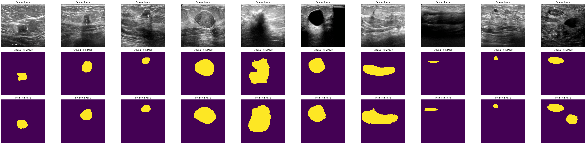

# BreastCancer-SemanticSegmantation

  Breast cancer ranks among the leading causes of death in women worldwide. Early and precise detection plays a vital role in enhancing treatment outcomes.

    
<!--  -->

  
  
  

  Some samples from patients.

  

  In recent years, deep learning-based semantic segmentation has demonstrated remarkable potential in medical image analysis, especially in accurately outlining cancer boundaries in ultrasound images.

  

  Therefore, we suggest some methods can deal with those tasks by comparing six semantic segmentation models—UNet, PSPNet, DeepLabV3+, TransUNet, Swin-Unet, and SegFormer—using two benchmark datasets: BUSI and BUS-WHU.

  

  You can read full version of reference through
  <a href="https://easychair.org/conferences2/submission_download?a=34672663&submission=7283684&upload=151756">Paper</a>.

  

### How semantics segmentation deals with those problems

  Breast cancer is currently one of the most life-threatening cancers diagnosed and continues to rise in prevalence worldwide.

  

  Early detection plays a crucial role in reducing mortality and improving patient outcomes (Crosby et al., 2022). With advancements in artificial intelligence (AI), semantic segmentation has become a promising technique for breast cancer detection

  

  A wide range of semantic segmentation models, particularly those based on deep learning, have been introduced (Hu et al., 2020).

  

  However, most of these models were originally developed for general object detection tasks—such as identifying vehicles or animals—and have seen limited application in the context of breast cancer.

  

  To address this gap, this study aims to evaluate and analyze the performance of deep learning-based semantic segmentation models on breast cancer datasets, with the goal of identifying the most effective architecture for accurate detection.

  
   

  In this subsection, we use two different datasets of breast ultrasound images to evaluate semantic segmentation models,
namely the Breast Ultrasound Images (BUSI) and the Breast Cancer Ultrasound Image (BUSI_WHU).

  

  Both of those datasets are published and dowloaded through <a href="https://www.kaggle.com/datasets/aryashah2k/breast-ultrasound-images-dataset">Breast Ultrasound Images (BUSI)</a> and <a href="https://data.mendeley.com/datasets/k6cpmwybk3/1">Breast Cancer Ultrasound Image (BUSI_WHU)</a>.

  

### Experimental results  

  Deep Learning-Based Semantic Segmentation models can be classified into two main types: CNN-based methods (Unet, PSPNet, DeeplabV3+) and Transformer-based models (TransUnet, SwinUnet,and Segformer)

  
To obtain the results of all models on both datasets, we utilized Kaggle as the computing platform.  

Notebooks use Breast Ultrasound Images (BUSI) dataset (Those notebook may not have equal results compared to our reference because of different runs):

Unet: [Notebook](https://www.kaggle.com/code/datnguyentien204/unet-breast-1b)  

PSPNet: [Notebook](https://www.kaggle.com/code/datnguyentien204/pspnet-breast-1b)  

DeepLabV3+: [Notebook](https://www.kaggle.com/code/datnguyentien204/deeplabv3-breast-1-without-expanded-dataset)  

Segformer: [Notebook](https://www.kaggle.com/code/datnguyentien204/segformer-breast-1b)  
 
SwinUnet: [Notebook](https://www.kaggle.com/code/giangtunhng/swin-unet-breast-1b)  

TransUnet: [Notebook](https://www.kaggle.com/code/giangtunhng/transunet-breast-1)  
You can see our detection score of compared semantic segmentation models on the BUSI dataset:
| Method       | Accuracy     | mIoU     | Dice      |
|--------------|--------------|----------|-----------|
| Unet         | 0.946        | 0.560    | 0.718     |
| PSPNet       | 0.950        | 0.539    | 0.701     |
| DeepLabV3+   | 0.965        | 0.654    | 0.791     |
| TransUnet    | 0.963        | 0.647    | 0.746     |
| Swin-Unet    | 0.943        | 0.712    | 0.776     |
| Segformer    | 0.944        | 0.594    | 0.745     |

Notebooks use Breast Cancer Ultrasound Image (BUSI_WHU) Dataset (Those notebook may not have equal results compared to our reference because of different runs) :

Unet: [Notebook](https://www.kaggle.com/code/datnguyentien204/unet-breast-2b)  

PSPNet: [Notebook](https://www.kaggle.com/code/datnguyentien204/pspnet-breast-2b)  

DeepLabV3+: [Notebook](https://www.kaggle.com/code/datnguyentien204/deeplabv3-breast-2a)  

Segformer: [Notebook](https://www.kaggle.com/code/giangtunhng/segformer-breast-2)  
 
SwinUnet: [Notebook](https://www.kaggle.com/code/giangtunhng/swin-unet-breast-2b)  

TransUnet: [Notebook](https://www.kaggle.com/code/giangtunhng/transunet-breast-2)  
You can see our detection score of compared semantic segmentation models on the BUSI_WHU dataset:
| Method       | Accuracy     | mIoU (%) | Dice      |
|--------------|--------------|----------|-----------|
| Unet         | 0.979        | 0.758    | 0.862     |
| PSPNet       | 0.975        | 0.705    | 0.827     |
| DeepLabV3+   | 0.983        | 0.789    | 0.882     |
| TransUnet    | 0.986        | 0.796    | 0.881     |
| Swin-Unet    | 0.993        | 0.812    | 0.831     |
| Segformer    | 0.985        | 0.798    | 0.888     |
<!--  -->

  

  Visualize some results

